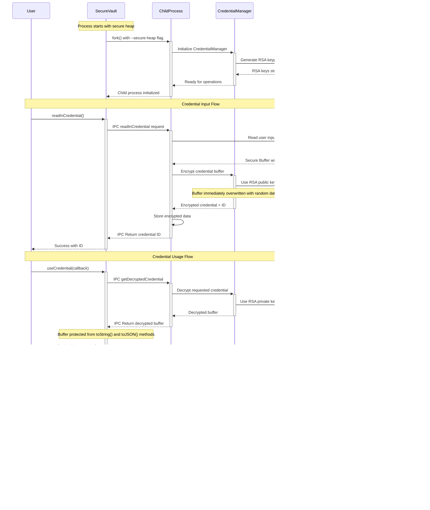

# SecureVault Security Flow

## Credential Lifecycle Sequence

```mermaid
sequenceDiagram
    participant User
    participant SecureVault
    participant ChildProcess
    participant CredentialManager
    participant SecureHeap
    participant BufferIO
    
    Note over SecureVault: Process starts with secure heap
    SecureVault->>+ChildProcess: fork() with --secure-heap flag
    ChildProcess->>+CredentialManager: Initialize CredentialManager
    CredentialManager->>+SecureHeap: Generate RSA keypair in secure heap
    SecureHeap-->>-CredentialManager: RSA keys stored securely
    CredentialManager-->>-ChildProcess: Ready for operations
    ChildProcess-->>-SecureVault: Child process initialized
    
    Note over User,BufferIO: Credential Input Flow
    User->>+SecureVault: readInCredential()
    SecureVault->>+ChildProcess: IPC readInCredential request
    ChildProcess->>+BufferIO: Read user input securely
    Note over BufferIO: Input goes directly to Buffer Never stored as string
    BufferIO-->>-ChildProcess: Secure Buffer with credential
    ChildProcess->>+CredentialManager: Encrypt credential buffer
    CredentialManager->>SecureHeap: Use RSA public key from secure heap
    Note over CredentialManager: Buffer immediately overwritten with random data
    CredentialManager-->>-ChildProcess: Encrypted credential + ID
    ChildProcess->>ChildProcess: Store encrypted data
    ChildProcess-->>-SecureVault: IPC Return credential ID
    SecureVault-->>-User: Success with ID
    
    Note over User,SecureHeap: Credential Usage Flow
    User->>+SecureVault: useCredential(callback)
    SecureVault->>+ChildProcess: IPC getDecryptedCredential
    ChildProcess->>+CredentialManager: Decrypt requested credential
    CredentialManager->>SecureHeap: Use RSA private key from secure heap
    CredentialManager-->>-ChildProcess: Decrypted buffer
    ChildProcess-->>-SecureVault: IPC Return decrypted buffer
    Note over SecureVault: Buffer protected from toString() and toJSON() methods
    SecureVault->>User: Execute callback with secure buffer
    Note over SecureVault: Buffer sanitized with crypto.randomFillSync()
    SecureVault-->>-User: Callback result
    
    Note over SecureVault,SecureHeap: Cleanup and Security Throughout lifecycle
    SecureVault->>SecureVault: Track all received buffers
    CredentialManager->>CredentialManager: Track active buffers
    Note over SecureVault,CredentialManager: On shutdown or error
    SecureVault->>SecureVault: Sanitize all tracked buffers
    CredentialManager->>CredentialManager: Sanitize all active buffers
    ChildProcess->>SecureHeap: Clear secure heap allocation
```
