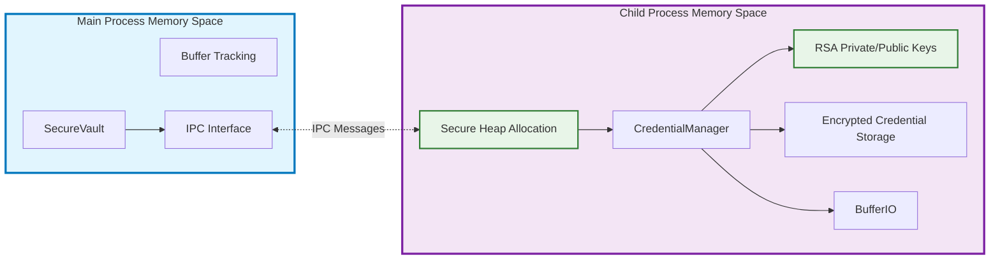
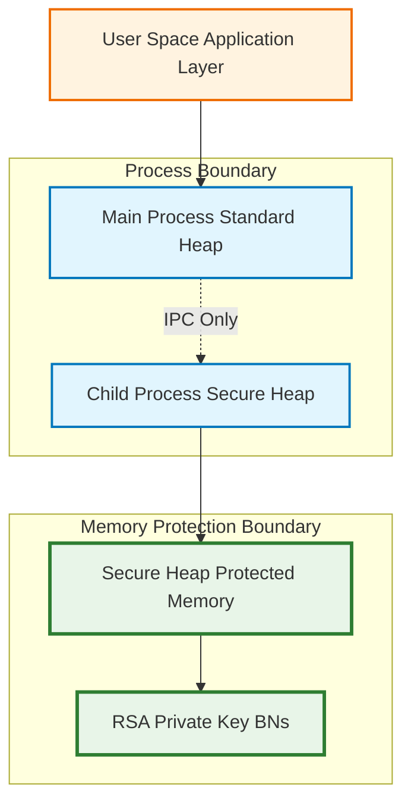

# Process Isolation Architecture

## Multi-Process Security Model

```mermaid
graph LR
    subgraph MainProcess[Main Process Memory Space]
        SecureVault[SecureVault]
        BufferTracking[Buffer Tracking]
        IPCInterface[IPC Interface]
    end
    
    subgraph ChildProcess[Child Process Memory Space]
        SecureHeapAllocation[Secure Heap Allocation]
        CredentialManager[CredentialManager]
        RSAKeys[RSA Private/Public Keys]
        EncryptedStorage[Encrypted Credential Storage]
        BufferIO[BufferIO]
    end
    
    SecureVault --> IPCInterface
    IPCInterface <-.->|IPC Messages| SecureHeapAllocation
    
    SecureHeapAllocation --> CredentialManager
    CredentialManager --> RSAKeys
    CredentialManager --> EncryptedStorage
    CredentialManager --> BufferIO
    
    classDef mainProcess fill:#e1f5fe,stroke:#0277bd,stroke-width:3px
    classDef childProcess fill:#f3e5f5,stroke:#7b1fa2,stroke-width:3px
    classDef secure fill:#e8f5e8,stroke:#2e7d32,stroke-width:2px
    
    class MainProcess mainProcess
    class ChildProcess childProcess
    class SecureHeapAllocation,RSAKeys secure
```

## Security Boundaries

```mermaid
graph TB
    UserSpace[User Space Application Layer]
    
    subgraph ProcessBoundary[Process Boundary]
        MainProc[Main Process Standard Heap]
        ChildProc[Child Process Secure Heap]
    end
    
    subgraph MemoryBoundary[Memory Protection Boundary]
        SecureHeap[Secure Heap Protected Memory]
        RSAPrivateKey[RSA Private Key BNs]
    end
    
    UserSpace --> MainProc
    MainProc -.->|IPC Only| ChildProc
    ChildProc --> SecureHeap
    SecureHeap --> RSAPrivateKey
    
    classDef userLayer fill:#fff3e0,stroke:#ef6c00,stroke-width:2px
    classDef processLayer fill:#e1f5fe,stroke:#0277bd,stroke-width:2px
    classDef secureLayer fill:#e8f5e8,stroke:#2e7d32,stroke-width:3px
    
    class UserSpace userLayer
    class MainProc,ChildProc processLayer
    class SecureHeap,RSAPrivateKey secureLayer
```
