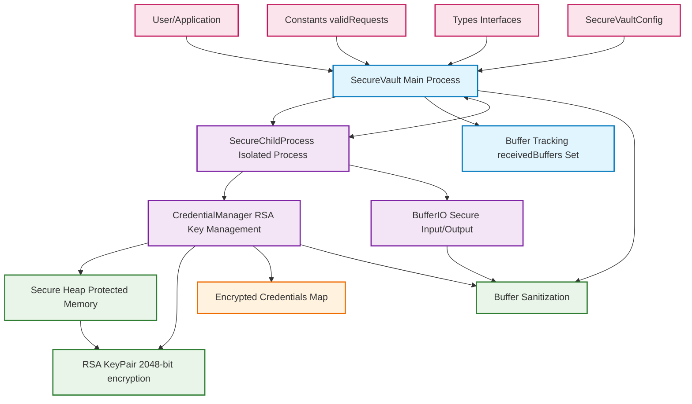

```mermaid
graph TB
    User[User/Application] --> SecureVault[SecureVault Main Process]
    
    SecureVault --> ChildProcess[SecureChildProcess Isolated Process]
    SecureVault --> BufferTracker[Buffer Tracking receivedBuffers Set]
    
    SecureVault <--> ChildProcess
    
    ChildProcess --> CredentialManager[CredentialManager RSA Key Management]
    ChildProcess --> BufferIO[BufferIO Secure Input/Output]
    
    CredentialManager --> SecureHeap[Secure Heap Protected Memory]
    CredentialManager --> RSAKeys[RSA KeyPair 2048-bit encryption]
    SecureHeap --> RSAKeys
    
    CredentialManager --> EncryptedStorage[Encrypted Credentials Map]
    
    SecureVault --> BufferSanitization[Buffer Sanitization]
    CredentialManager --> BufferSanitization
    BufferIO --> BufferSanitization
    
    Constants[Constants validRequests] --> SecureVault
    Types[Types Interfaces] --> SecureVault
    Config[SecureVaultConfig] --> SecureVault
    
    classDef mainProcess fill:#e1f5fe,stroke:#0277bd,stroke-width:2px
    classDef childProcess fill:#f3e5f5,stroke:#7b1fa2,stroke-width:2px
    classDef security fill:#e8f5e8,stroke:#2e7d32,stroke-width:2px
    classDef storage fill:#fff3e0,stroke:#ef6c00,stroke-width:2px
    classDef interface fill:#fce4ec,stroke:#c2185b,stroke-width:2px
    
    class SecureVault,BufferTracker mainProcess
    class ChildProcess,CredentialManager,BufferIO childProcess
    class SecureHeap,RSAKeys,BufferSanitization security
    class EncryptedStorage storage
    class User,Constants,Types,Config interface
```