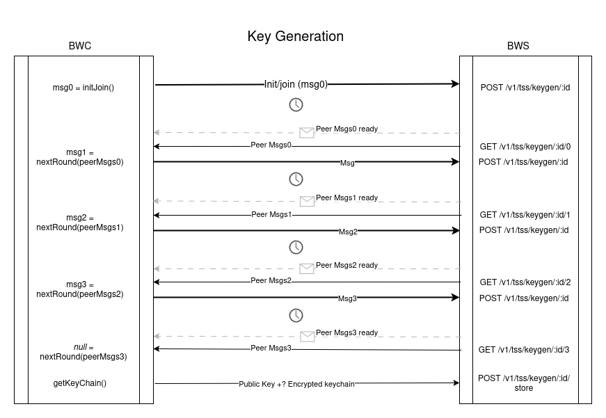
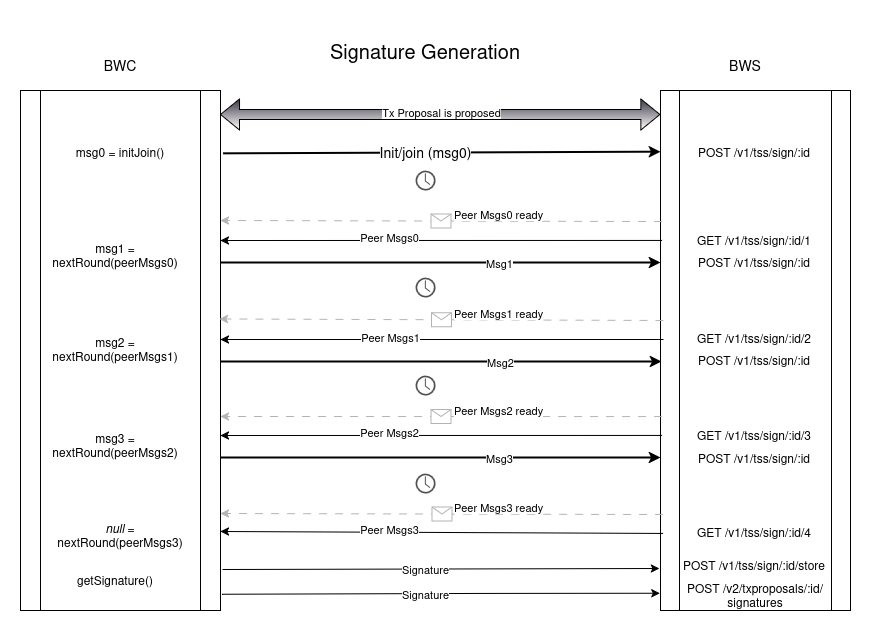

# DKG
This document explains the specs for the client implementation of distributed _key_ generation (DKG) for the threshold signature scheme (TSS). This logic is mostly abstracted away by the `TssKeyGen` class in `bitcore-wallet-client/lib/tsskey.ts`.


### Asynchronous DKG
If the DKG ceremony is executed asynchronously (meaning all parties are not required to be online at the same time during the DKG), the `keyGen.export()` function should be used between each step to export the local session state. The session state should be securely stored and used with `KeyGen.restore()` for following steps.

### Flow Diagram


### API Spec

<details>
<summary style="font-size:17px"><span style="font-weight:bold">POST</span> /v1/tss/keygen/:id</summary>

Initialize the `KeyGen` class with a seed that is the derived private key.

> E.g.: given your HD master key, derive an Ethereum key along the Ethereum standard path m/44'/60'/0'/\<index>. The resulting private key will be the seed for the KeyGen class.

**If you are creating a session**, your partyId should be 0.

**If you are joining a session**, the join code should have your partyId.

### Request body:
```typescript
{
  message: object, // Message object from the TSS keygen initJoin() or nextRound() methods
  n?: number, // Number of participants. Only provided by party 0 when initiating the session
  password?: string // Optional join password set by party 0 when initiating the session
}
```

### Response body:
```typescript
None
```
</details>

<details>
<summary style="font-size:17px"><span style="font-weight:bold">GET</span> /v1/tss/keygen/:id/:round</summary>

### Request body:
```typescript
None
```

### Response body:
```typescript
{
  messages?: Array, // Array of P2P or Broadcast messages ready to be given to the TSS keygen nextRound() method. Only given if ALL other-party messages are posted
  publicKey?: string, // The resulting public key at the end of the session
  hasKeyBackup?: boolean // Indicates if this party's encrypted key share has been backed up to the server
}
```
</details>

<details>
<summary style="font-size:17px"><span style="font-weight:bold">POST</span> /v1/tss/keygen/:id/store</summary>


### Request body:
```typescript
{
  publicKey?: string, // The resulting public key 
  encryptedKeyChain?: string, // Your encrypted key share
}
```
> THIS IS A SUB-OPTIMAL ENDPOINT. We do NOT want users to be dependent on our servers for recovering their funds. However, this is a stop-gap until we have DKG recovery implemented.

### Response body:
```typescript
None
```
</details>

<span style="padding:20px"> </span>

# DSG
This document explains the specs for the client implementation of distributed _signature_ generation (DSG) for the threshold signature scheme (TSS). This logic is mostly abstracted away by the `TssSign` class in `bitcore-wallet-client/lib/tsssign.ts`.


### Asynchronous DSG
If the DSG ceremony is executed asynchronously (meaning all signing parties are not required to be online at the same time during the DSG), the `sign.export()` function should be used between each step to export the local session state. The session state should be securely stored and used with `Sign.restore()` for following steps.

### Flow Diagram


### API Spec
<details>
<summary style="font-size:17px"><span style="font-weight:bold">POST</span> /v1/tss/sign/:id</summary>

### Request body:
```typescript
{
  message: object // Message object from the TSS sign initJoin() or nextRound() methods
}
```

### Response body:
```typescript
None
```
</details>

<details>
<summary style="font-size:17px"><span style="font-weight:bold">GET</span> /v1/tss/sign/:id/:round</summary>

### Request body:
```typescript
None
```

### Response body:
```typescript
{
  messages?: Array, // Array of P2P or Broadcast messages ready to be given to the TSS keygen nextRound() method. Only given if ALL other-party messages are posted
  signature?: // The resulting signature at the end of the session. The existence indicates the session has ended
}
```
</details>

<details>
<summary style="font-size:17px"><span style="font-weight:bold">POST</span> /v1/tss/sign/:id/store</summary>

### Request body:
```typescript
{
  signature?: string, // Provided after the final round
}
```

### Response body:
```typescript
None
```
</details>